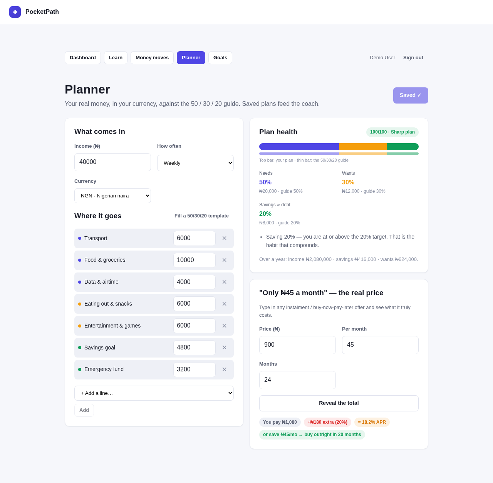

# 💠 PocketPath — money skills for students, with the results measured

> **GatewayHacks 2026 · Track 2, Equity in Education.** A learn-→-decide-→-apply financial-literacy app for 13–22-year-olds that measures whether it worked: a baseline test, eight explained-answer modules, a consequences simulator, a real-money planner in the student's own currency, and a coach that only ever talks about *their* numbers. Runs anywhere, offline, no API keys.

**Live demo:** https://pocketpath-ctbb.onrender.com · demo login `demo@example.com` / `demo-password-123` · health: `https://pocketpath-ctbb.onrender.com/api/health` *(free tier: first load after idle takes ~1 min)*



## The problem

Financial literacy is the life skill most schools never teach, and the students who miss it are the ones who can least afford the mistakes: the first "only $40 a month" phone plan, the friend loan that never comes back, the paycheck gone by Tuesday. Most free resources are US-centric, dollar-only, reading-heavy, and — critically — never check whether the reader actually learned anything. Equity in education is not just access to content; it is access to content that fits your context **and proves it worked**.

## What PocketPath does

| Step | Feature | Why it matters |
|---|---|---|
| **Measure first** | 6-question **baseline** with explained answers | The "before" photo. Without it, no one — student, teacher, judge — can tell whether the app helped. |
| **Learn** | Eight 4-minute modules (budgeting, saving, credit, spending traps, investing, goal maths, earning & net pay, scams & digital safety), each with a 3-question check that explains **every** option | Short enough to finish on a phone between classes; explanations turn a wrong answer into the lesson. |
| **Decide** | **Money Moves** — eight real-life scenarios (birthday cash, phone upgrade, first paycheck, flash sale, friend loan, emergency, the 'double your money' DM, the subscription pile). Each choice moves wallet, debt, confidence and a **decision-quality score** | Knowledge ≠ behaviour. The simulator makes the consequences visible before real money is involved. |
| **Apply** | **Planner** — enter your real allowance / paycheck in any of 15 currencies (₦, KSh, ₹, Rs, ₱, R, $, €, £ …), split it into lines, and see it against the 50 / 30 / 20 guide with a **health score**, concrete tips ("move ₦3,200 from eating out to savings to hit 20%") and a yearly projection. Plus a **"real price of 'only X a month'"** calculator that reveals the total, the extra paid and the implied APR of any instalment offer | Localised numbers are what make it *usable* outside the US. The financing check targets the single most common trap for young earners. |
| **Track** | **Goals** with weekly-rate maths and ETA dates; streaks | Turns intentions into dates. |
| **Coach** | A **money coach** that answers "how is my budget looking?", "where do my goals stand?", "should I finance this phone?", "what is compound interest?" — grounded in the student's own plan, goals, scores and simulator state | Runs fully offline via deterministic skills; add any OpenAI-compatible key and the same grounded prompt drives an LLM. Never invents figures. |
| **Prove it** | **Post-assessment** → measured gain vs. baseline on the dashboard | The outcome metric of the whole app. |

## Impact — what we can measure

- **Learning gain**: post − pre assessment score per student (shown on the dashboard, stored per profile).
- **Behaviour**: decision-quality score across Money Moves (0–1), debt carried, wallet trajectory.
- **Application**: plan health score (0–100) and savings share vs. the 20% guide; number of students with a saved plan and a named goal.
- **Reach / equity**: 15 currencies, works on a low-end phone (≈ 60 kB gzipped JS), zero external calls, deployable on a single small server or a school laptop.

Honest limits: content is a starting curriculum, not a full course; scores measure short-term recall and simulated decisions, not long-term behaviour; there is no teacher dashboard yet (see Roadmap).

## Run it

```bash
git clone https://github.com/favour187/gatewayhacks-2026.git
cd gatewayhacks-2026
python -m venv .venv && source .venv/bin/activate   # Windows: .venv\Scripts\activate
pip install -e ".[dev]"
uvicorn app.main:app --reload --port 8000            # API docs: http://localhost:8000/api/docs
```

```bash
cd web && npm install && npm run dev                 # http://localhost:5173 (proxies /api → :8000)
```

One container: `docker compose up --build` → http://localhost:8000.
Demo account (development mode): `demo@example.com` / `demo-password-123`.
Tests: `python -m pytest` (17 tests).

Optional `.env`: `AI_MODE=auto|local|remote`, `AI_API_KEY`, `AI_BASE_URL`, `AI_MODEL` (any OpenAI-compatible endpoint). Without a key the coach uses the built-in deterministic skills.

## How it is built

- **Backend** — Python 3.11+, FastAPI, Pydantic, SQLAlchemy 2 (SQLite), PBKDF2 sessions. `app/features/finlit/`: `content.py` (modules, quizzes, assessment, scenarios), `core.py` (grading, simulator state, goal maths), `planner.py` (budget scoring, financing/APR solver, currencies), `ai_skills.py` (coach skills + LLM prompt), `service.py`, `repository.py`, `routers.py`.
- **AI layer** — `app/core/ai.py` gateway: local deterministic provider by default, OpenAI-compatible remote provider with retries/caching/fallback. The coach's system prompt embeds a compact JSON of the student's state; the same context is used offline and online.
- **Frontend** — React 18 + TypeScript + Vite, a small in-repo UI kit, responsive down to 360 px, dark-mode aware.
- **Quality** — pytest suite (content integrity, projection maths, planner scoring, financing APR, full API flows, assessment gain), CI workflow, Dockerfile.

## Roadmap

Teacher/classroom dashboard (aggregate gains, anonymised); localised scenario packs (amounts and prices per country); offline-first PWA; spaced-repetition review of missed questions; export of a "money plan" PDF.

## AI-assistance disclosure

Built with AI coding assistance (Claude-based agent tooling on the Arena.ai platform) under the author's direction; all design, content and code were reviewed and are understood by the author. See [docs/COMPLIANCE.md](docs/COMPLIANCE.md).


## Deploy (Render free tier + Neon Postgres)

The repo ships a [`render.yaml`](render.yaml) Blueprint: one Docker web service, no paid add-ons.

1. **Neon** (free): create a project → copy the connection string (`postgresql://…?sslmode=require`).
2. **Render**: Dashboard → *New* → *Blueprint* → select this repo → when prompted, paste the Neon URL into `DATABASE_URL` → *Apply*.
3. Open the service URL — this project's is https://pocketpath-ctbb.onrender.com. Health: `/api/health`. Judges can log in with `demo@example.com / demo-password-123` (`SEED_DEMO_USER=true`).

Notes: `postgres://` and `postgresql://` URLs are auto-mapped to the psycopg 3 driver (`pip install ".[postgres]"`); tables are created on first boot. Free web services sleep after 15 min idle (~1 min cold start) — open the URL a minute before a live demo. Without `DATABASE_URL` the container falls back to SQLite on its ephemeral disk (data resets on restart).

## License

MIT — see [LICENSE](LICENSE).
